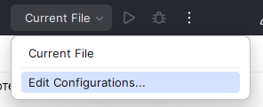
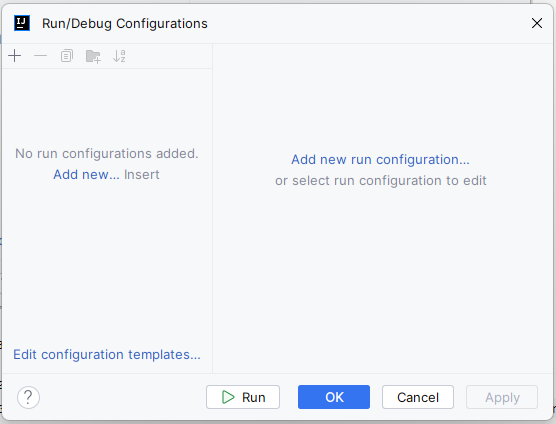
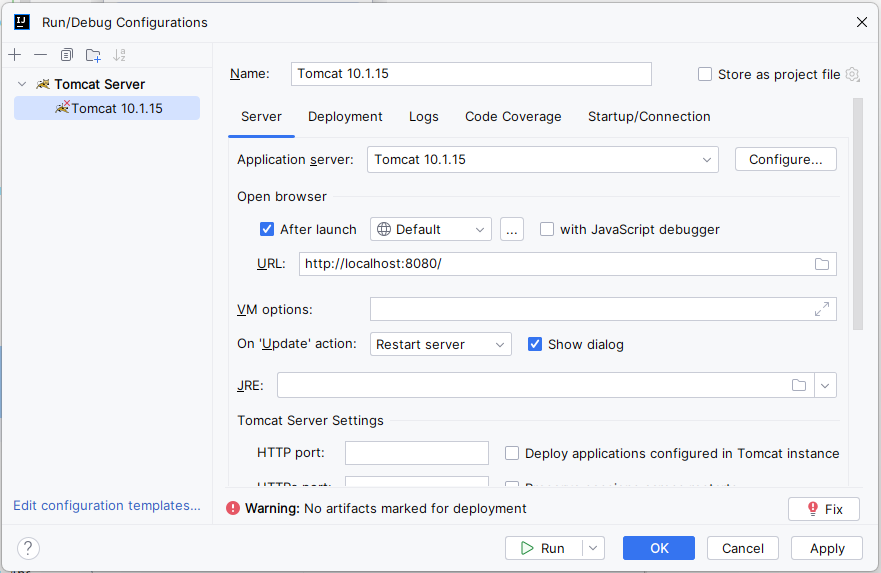
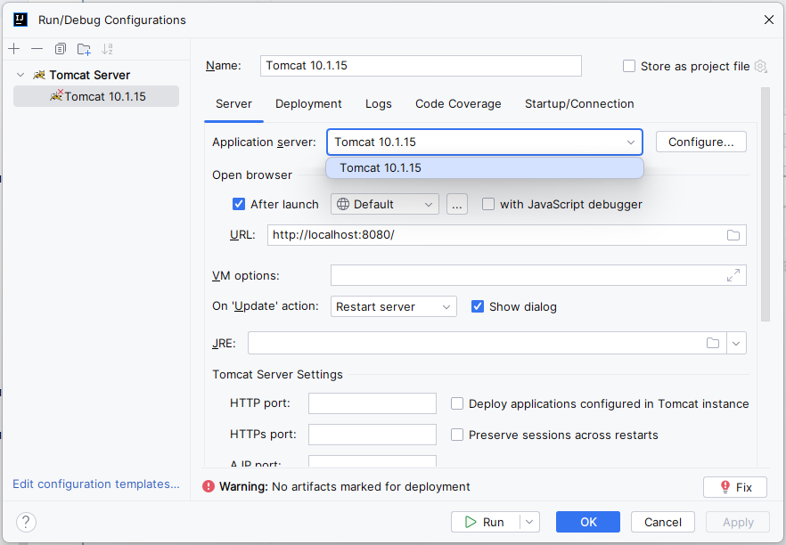
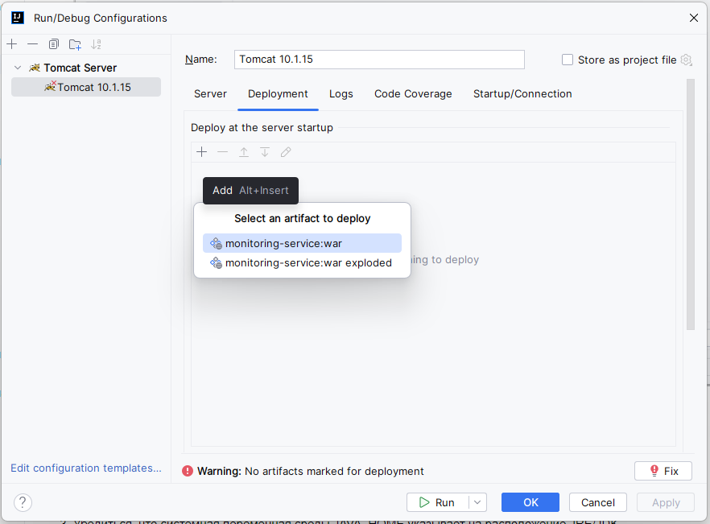
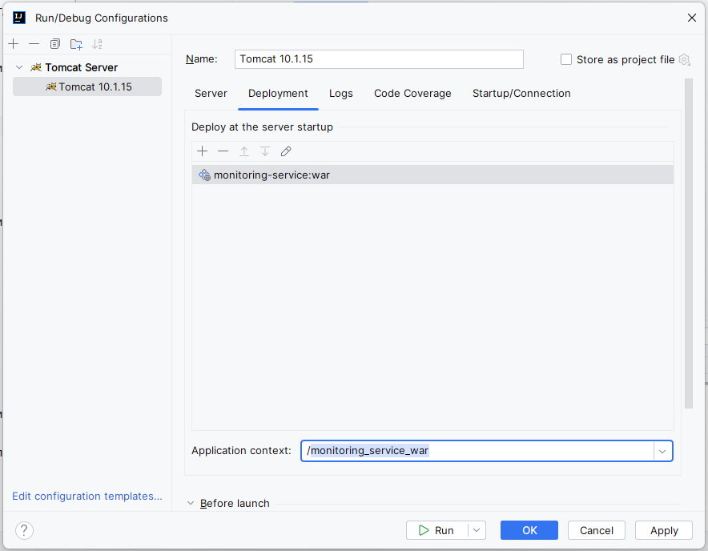

# Monitoring Service

### Примеры http запросов находятся в [этом файле](src/main/resources/http/examples.http)
### Основная информация

- Проект написан на Java 17.0.4
- Для развёртывания проекта использовался контейнер сервлетов Apache Tomcat 10.1.15
- Для сборки проекта использовался Apache Maven (maven-war-plugin для упаковки проекта)
- Для автогенерации boilerplate кода использовалась библиотека Lombok.
- Для реализации АОП-функционала использовалась библиотека AspectJ
- Для тестирования проекта использовались библиотеки JUnit 5 и Mockito.

### Инструкция по сборке

1. Скомпилировать проект, упаковать его в .war архив:

    ```
    mvn clean package
    ```

### Развёртывание

1. Запустить docker-контейнер с БД PostgreSQL:

    ```
    docker-compose up -d
    ```

2. Развернуть проект в Apache Tomcat. Несколько вариантов описаны ниже, в разделе "Деплой проекта в Apache Tomcat"

### Развёртывание проекта в Apache Tomcat

[1] Конфигурация развёртывания в Intellij IDEA

1. Скачать и распаковать Apache Tomcat 10.1.18
2. Разрешить к исполнению файлы startup.sh и catalina.sh, находящиеся в папке `bin` в месте распаковки Apache Tomcat
3. Убедиться, что системная переменная среды JAVA_HOME указывает на расположение JRE/JDK
4. Открыть меню создания конфигурации проекта:

   
5. Нажать `Add new run configuration`:

   
6. В списке выбрать `Tomcat Server` -> `Local`. Появится следующее окно

   
7. При отсутствии предложенной версии `Application Server` нажать кнопку `Configure`, выбрать место, где был распакован Apache Tomcat:

   
8. Также нажать кнопку `Fix` или самостоятельно перейти на вкладку `Deployment` и добавить `.war` архив из директории `target` проекта:

   
9. При необходимости скорректировать путь развёртывания приложения, затем нажать кнопку `Run`. Приложение готово к работе.

   

[2] Развёртывание вручную

1. Скачать и распаковать Apache Tomcat 10.1.18
2. Разрешить к исполнению файлы startup.sh и catalina.sh, находящиеся в папке `bin` в месте распаковки Apache Tomcat
3. Убедиться, что системная переменная среды JAVA_HOME указывает на расположение JRE/JDK
4. Запустить Tomcat, выполнив startup.sh или catalina.sh
5. Перейти в директорию `target` проекта, переименовать `.war` файл в `ROOT.war`
6. Очистить содержимое папки `webapps` (папка находится в месте распаковки Apache Tomcat)
7. Скопировать в папку `webapps` архив `ROOT.war`

[3] Развёртывание через интерфейс Tomcat

1. Скачать и распаковать Apache Tomcat 10.1.18
2. Разрешить к исполнению файлы startup.sh и catalina.sh, находящиеся в папке `bin` в месте распаковки Apache Tomcat
3. Убедиться, что системная переменная среды JAVA_HOME указывает на расположение JRE/JDK
4. В месте распаковки Tomcat открыть директорию `conf`, в ней файл `server.xml`. Описать там логин и пароль пользователя с правами доступа администратора.
5. Запустить Tomcat, выполнив startup.sh или catalina.sh
6. Перейти по адресу http://localhost:8080/manager
7. Ввести описанные в п.4 логин и пароль
8. Развернуть приложение используя пользовательский интерфейс